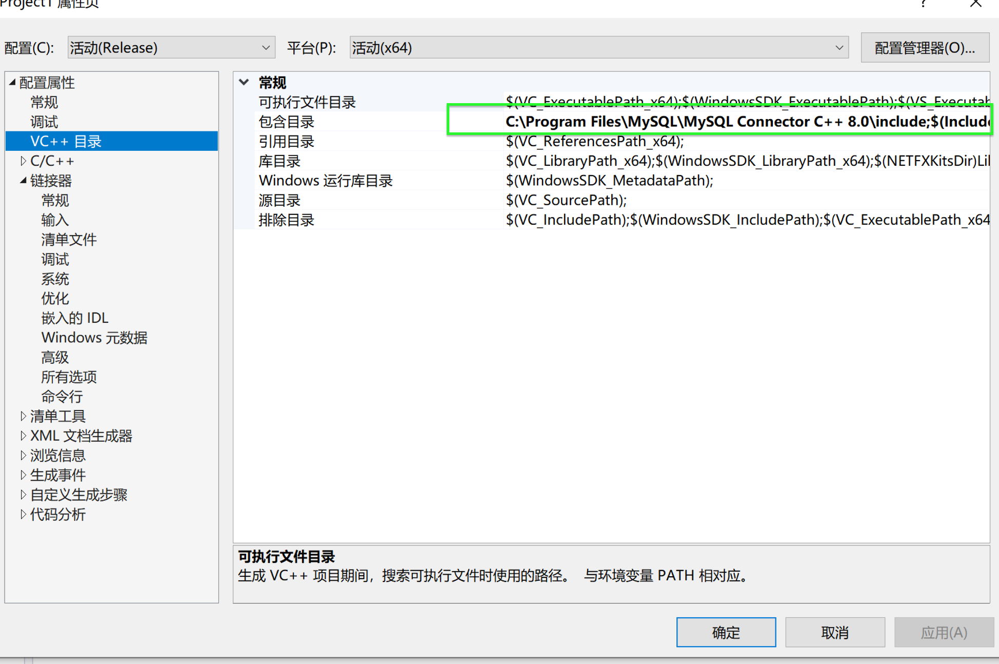
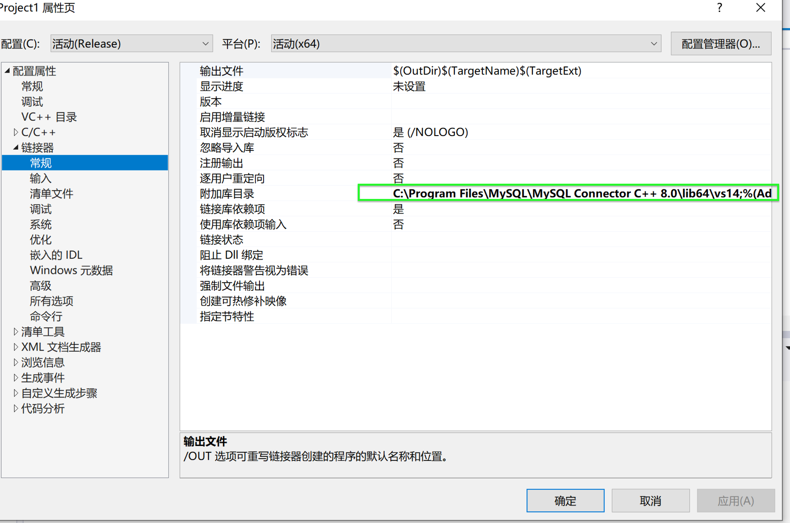
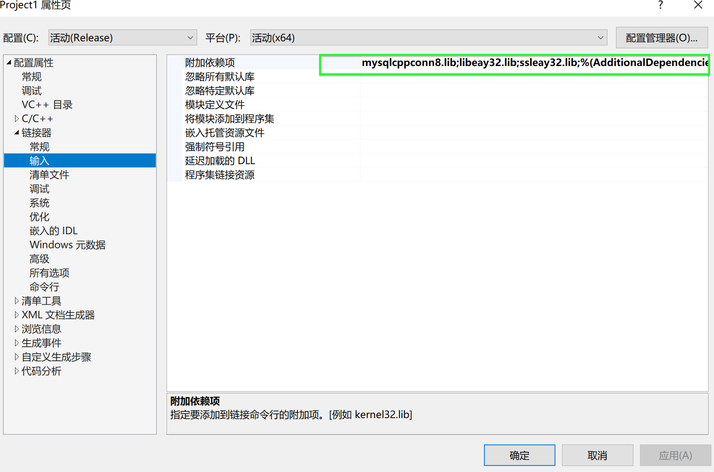

#VS2015/VS2017连接Mysql数据库教程 

要给C++程序连接MySQL数据库，分别需要：

安装MySQL Server
下载MySQL Connector/C++
在IDE中配置依赖
然后就可以在代码中调用API，来连接以及操作数据库。
## 一、安装MySQL Server
这是MySQL 数据库服务，下载了它才能在自己的电脑中使用MySQL。
下载页面：Download MySQL Installer
参考教程：windows10上安装mysql（详细步骤）
安装好后，我们打开MySQL 5.7 Command Line Client（在开始菜单的快捷方式里，也可以搜索一下），然后

创建数据库
mysql> create database test;

使用数据库（这句不能加分号）
mysql> use test

查看已有的表
mysql> show tables;

创建表
mysql> create table testuser ( id INT, name CHAR(20));
## 二、下载MySQL Connector/C++
这是连接MySQL的库，我们在C++中需要使用该库来连接数据库。
下载页面：Download Connector/C++

## 三、IDE中配置依赖，以Visual Studio 2015为例
为了在我们的C++工程里方便地引用 Connector/C++库，就要配置一下项目的依赖。
Windows10系统下编写C++工程我一般用VS，其他的IDE可以参考官方文档，如Linux中用NetBeans：Building Connector/C++ Windows Applications with Microsoft Visual Studio，以下内容也是参考文档的。

### 3.1 选择编译方式
配置依赖前，先将默认的Debug模式改为Release模式。如果修改了编译方式，配置自然就改变了。


### 3.2 添加额外的Include目录
在VS菜单中选择 项目属性 =>C/C++=> 输入 => 附加包含目录


点击，然后选择NewLine(黄色按钮)，点“...”按钮选择MySQL Connector的路径，例如我的是C:\Program Files\MySQL\MySQL Connector C++ 8.0\include


这一步是为了让我们的C++程序可以引用连接sql相关的头文件。

### 3.3 添加额外的库目录
接着是 项目属性 => 链接器 => 输入 => 附加依赖库
同样的方法，路径是C:\Program Files\MySQL\MySQL Connector C++ 8.0\lib64\vs14
这一步使得.lib文件可以被找到。

### 3.4 静态库和动态库：
动态库与静态库优缺点比较
接着根据我们的需要，执行后续步骤：
如果用静态库，可能比较麻烦，因为静态库需要和编译器版本相匹配，因此需要手动编译一份，如果选择动态库可以直接跳转到3.5

### 3.4.1 下载MySQL Connector/C++源码
在官方下载页面，系统选择Source Code，然后版本选择64位，下载windows对应的版本。

### 3.4.2 下载安装CMake
在官方下载页面，下载最新的CMake的Windows win64-x64 Installer，安装好。

### 3.4.3 在vs中编译运行支持vs2017的静态库
参考Visual Studio 2015编译64位MySQL Connector/C++

我遇到的问题是报错说<my_global.h>的timespec已经定义了，于是在

```
#ifndef HAVE_STRUCT_TIMESPEC /* Windows before VS2015 */
上面加上

#define  HAVE_STRUCT_TIMESPEC
```

就好了。将编译出来的xxx.lib改名为mysqlcppconn-static.lib，放到项目根目录

### 3.5 添加额外的依赖
如果是静态库，需要：

在 项目属性 => C/C++=>预处理器=> 预处理中输入 CPPCONN_PUBLIC_FUNC=

在 项目属性 => 链接器 => 输入 => 附加依赖库 中添加 mmysqlcppconn8-static.lib,libeay32.lib,ssleay32.lib；

文件的目录 C:\Program Files\MySQL\MySQL Connector C++ 8.0\lib64\vs14 要填在 Configuration Properties => Linker => General => Additional Library directories中。

如果是动态库，则：

在 项目属性 => 链接器 => 输入 => 附加依赖库中添加 mmysqlcppconn8.lib,libeay32.lib,ssleay32.lib；


把C:\Program Files\MySQL\MySQL Connector C++ 8.0\lib64下的mysqlcppconn8.dll,libeay32.dll,ssleay32.dll 复制到我们的windows\system32目录下或者项目根目录\x64\Release下。